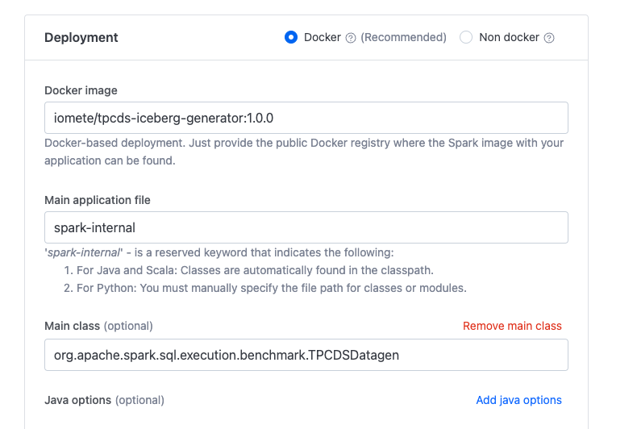
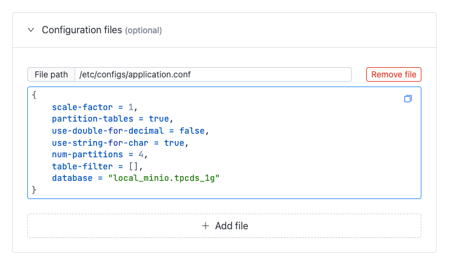

[](https://travis-ci.org/maropu/spark-tpcds-datagen)

This is a TPCDS data generator for Apache Spark, which is split off from [spark-sql-perf](https://github.com/databricks/spark-sql-perf)
and includes pre-built [tpcds-kit](https://github.com/davies/tpcds-kit) for Mac/Linux x86_64 platforms.
To check TPCDS performance regression, the benchmark results (sf=20) for the current Spark master
is daily tracked in the Google Spreadsheet ([performance charts](https://docs.google.com/spreadsheets/d/1V8xoKR9ElU-rOXMH84gb5BbLEw0XAPTJY8c8aZeIqus/edit?usp=sharing)).

Note that the current `master` branch intends to support [3.1.1](https://downloads.apache.org/spark/spark-3.1.1) on Scala 2.12.x. If you want to generate TPCDS data in Spark 3.0.x, please use [branch-3.0](https://github.com/maropu/spark-tpcds-datagen/tree/branch-3.0).

## How to generate TPCDS data in IOMETE

- Docker image: `iomete/tpcds-iceberg-generator:1.0.0`
- Main application file: `iomete/tpcds-iceberg-generator:1.0.0`
- Main class: `org.apache.spark.sql.execution.benchmark.TPCDSDatagen`

[](doc/images/spark-job-deployment.png)

Configuration file: `/etc/configs/application.conf`
```hocon
{
    scale-factor = 1,
    partition-tables = true,
    use-double-for-decimal = false,
    use-string-for-char = true,
    num-partitions = 4,
    table-filter = [],
    database = "local_minio.tpcds_1g"
}
```

[](doc/images/tpcds-config.png)

Explanation of the configuration parameters:
- `scale-factor`: The scale factor of the dataset to generate. Example: 1 means 1GB, 100 means 100GB, 1000 means 1TB, 10000 means 10TB.
- `partition-tables`: Whether it partitions output data (default: false)
- `use-double-for-decimal`: Whether it prefers double types instead of decimal types (default: false)
- `use-string-for-char`: Whether it prefers string types instead of char/varchar types (default: false)
- `num-partitions`: # of partitions (default: 100)
- `table-filter`: Queries to filter, e.g., catalog_sales,store_sales. The default value is an empty list, which means all tables will be generated.

Below are the list of all tables:
- catalog_returns
- inventory
- catalog_sales
- store_returns
- store_sales
- web_returns
- web_sales
- call_center
- catalog_page
- household_demographics
- customer
- customer_address
- customer_demographics
- date_dim
- income_band
- item
- promotion
- reason
- ship_mode
- store
- time_dim
- warehouse
- web_page
- web_site


## How to generate TPCDS data

You can generate TPCDS data in `/tmp/spark-tpcds-data`:

    # You need to set `SPARK_HOME` to your Spark v3.0.1 path before running a command below
    $ ./bin/dsdgen --output-location /tmp/spark-tpcds-data

## How to run TPCDS queries in Spark

If you run TPCDS quries on the master branch of Spark, you say a sequence of commands below:

    $ git clone https://github.com/apache/spark.git

    $ cd spark && ./build/mvn clean package -DskipTests

    $ ./bin/spark-submit \
        --class org.apache.spark.sql.execution.benchmark.TPCDSQueryBenchmark \
        --jars ${SPARK_HOME}/core/target/spark-core_<scala.version>-<spark.version>-tests.jar,${SPARK_HOME}/sql/catalyst/target/spark-catalyst_<scala.version>-<spark.version>-tests.jar \
        ${SPARK_HOME}/sql/core/target/spark-sql_<scala.version>-<spark.version>-tests.jar \
        --data-location /tmp/spark-tpcds-data

## Options for the generator

    $ ./bin/dsdgen --help
    Usage: spark-submit --class <this class> --conf key=value <spark tpcds datagen jar> [Options]
    Options:
      --scale-factor [NUM]                   Scale factor (default: 1)
      --partition-tables                     Whether it partitions output data (default: false)
      --use-double-for-decimal               Whether it prefers double types instead of decimal types (default: false)
      --use-string-for-char                  Whether it prefers string types instead of char/varchar types (default: false)
      --table-filter [STR]                   Queries to filter, e.g., catalog_sales,store_sales
      --num-partitions [NUM]                 # of partitions (default: 100)

## Run specific TPCDS quries only

To run a part of TPCDS queries, you type:

    $ ./bin/run-tpcds-benchmark --data-location [TPCDS data] --query-filter "q2,q5"

## Other helper scripts for benchmarks

To quickly generate the TPCDS data and run the queries, you just type:

    $ ./bin/report-tpcds-benchmark [TPCDS data] [output file]

This script finally formats performance results and appends them into ./reports/tpcds-avg-results.csv.
Notice that, if `SPARK_HOME` defined, the script uses the Spark.
Otherwise, it automatically clones the latest master in the repository and uses it.
To check performance differences with pull requests, you could set a pull request ID in the repository as an option
and run the quries against it.

    $ ./bin/report-tpcds-benchmark [TPCDS data] [output file] [pull request ID (e.g., 12942)]

## Bug reports

If you hit some bugs and requests, please leave some comments on [Issues](https://github.com/maropu/spark-sql-server/issues)
or Twitter([@maropu](http://twitter.com/#!/maropu)).

